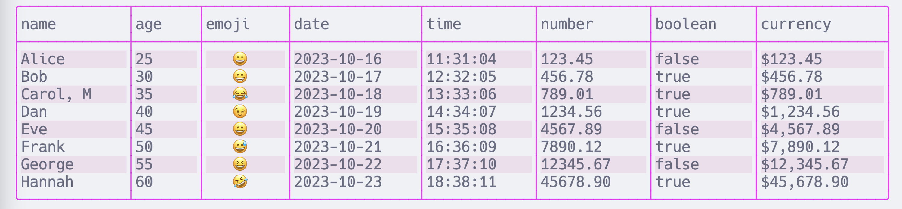

# CSView - a table viewer
## CSV to Markdown and back again

This project is scuffed because during the initial commit process I *deleted the project*. So this is just a quick reconstruction while I have a few hours on hand.

## Usage
Print Table: `csview print path/to/file.csv`
Convert Table: `csview convert path/to/file.csv path/to/file.md`

## Features
- Print tables to the commandline